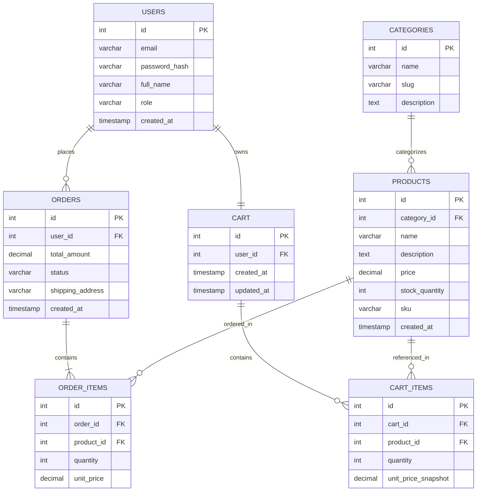

# Sprint 1: System Architecture & Scope Definition

## 1. Target Audience & Market Focus

**Primary Persona:** Tech-savvy young adults (ages 18–30) who shop for casual streetwear and lifestyle apparel online, and who expect fast, mobile-friendly browsing plus a smooth checkout.

**Core Pain Point:** Niche apparel storefronts often pair slow, unfiltered catalog browsing with checkout flows that lose customers at the cart stage. Shoppers want a lightweight platform where they can search/filter quickly, keep a persistent cart across sessions, and complete a purchase in a few clicks.

**Domain Scope:** Apparel — Streetwear & Casualwear (t-shirts, hoodies, outerwear, accessories).

## 2. MVP Feature Scope Matrix

| Category | Feature Name | Description | Priority |
|---|---|---|---|
| Authentication | User Registration & Authentication | Email/password sign-up and login with password hashing (bcrypt) and JWT-based session authentication. | High (MVP) |
| Catalog | Product List & Search | Browsing interface with category-based filtering, keyword search, and sorting (price, newest). | High (MVP) |
| Cart | Cart Management | Persistent cart tied to the user account (add, update quantity, remove items) that survives across sessions. | High (MVP) |
| Checkout | Order Processing | Mock/Stripe test-mode payment integration; creates an Order + Order_Items record on success. | High (MVP) |
| Admin | Inventory Control | Admin-only CRUD operations for products, categories, and stock levels. | Medium |
| Account | Order History | Authenticated users can view their past orders and order status. | Medium |

## 3. Tech Stack Selection & Justification

- **Frontend Framework:** React (with Vite)
  *Justification:* React's component model fits a catalog/cart/checkout UI well, and its ecosystem (React Router, React Query) speeds up building the required flows solo within a semester. Vite keeps the dev/build loop fast compared to heavier framework tooling for a project this size.

- **Backend Infrastructure:** Node.js / Express
  *Justification:* Using JavaScript across the stack reduces context-switching for a single developer and has mature libraries for JWT auth, password hashing, and Stripe integration. Express stays unopinionated, which keeps the API surface simple for a 4–6 feature MVP.

- **Database Management System:** PostgreSQL
  *Justification:* Orders, order items, and inventory counts need strong relational integrity and transactional guarantees (e.g., stock should never go negative), which a relational DB enforces better than a document store. PostgreSQL's foreign keys and constraints map directly onto the ERD's PK/FK relationships below.

- **Caching & Asynchronous Processing (Optional):** Redis
  *Justification:* Redis can back session/cart lookups for faster reads and could later queue non-blocking tasks like order-confirmation emails, though it isn't required for the core MVP.

## 4. Entity-Relationship Diagram (ERD)

### Relationship & Cardinality Notes

| Relationship | Cardinality | Notes |
|---|---|---|
| Users → Orders | 1:N | One user places zero or more orders. |
| Users → Cart | 1:1 | Each user owns exactly one active cart. |
| Cart → Cart_Items | 1:N | A cart holds zero or more cart items. |
| Orders → Order_Items | 1:N (mandatory) | An order must contain at least one order item. |
| Categories → Products | 1:N | A category groups zero or more products. |
| Products ↔ Orders | N:M (via Order_Items) | A product can appear in many orders and an order can include many products; Order_Items is the associative entity resolving this many-to-many relationship. |
| Products ↔ Cart | N:M (via Cart_Items) | Same pattern as above, resolved by Cart_Items for in-progress carts. |

**Keys:** every entity uses a surrogate integer `id` as its Primary Key (PK). Foreign Keys (FK) — `user_id` (Orders, Cart), `category_id` (Products), `cart_id` / `product_id` (Cart_Items), `order_id` / `product_id` (Order_Items) — enforce the relationships above and would be declared with `REFERENCES` constraints in PostgreSQL.
