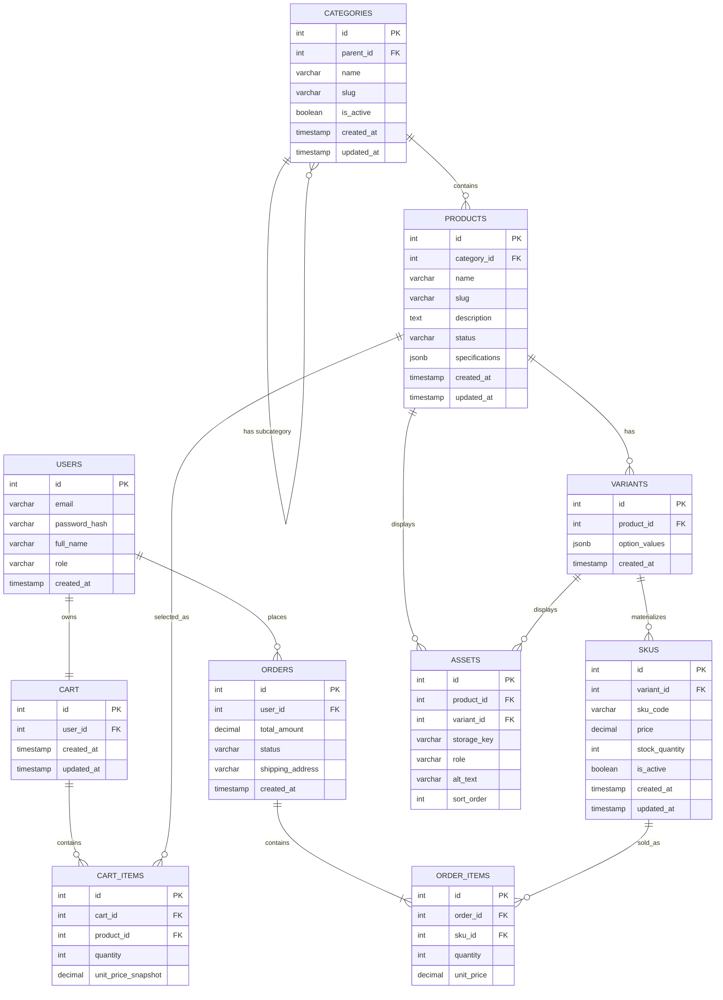

# Sprint 2: Catalog Data Foundation

15-day implementation sprint. Builds the category → product → variant → SKU
data model, migrations, authenticated admin CRUD, seed data, and tests that
Sprint 3's storefront, cart, and checkout will consume.

## 1. Sprint Goal and Scope Boundary

**Goal:** given a product catalog administrator, the system must persist
categories, products, variants, and SKUs without losing identity,
relationship, price, or inventory meaning.

**In scope**
- Category tree management with stable identifiers and slugs.
- Product creation and editing, including status and descriptive content.
- Variants and SKU records with unique codes, price, stock, and availability.
- Basic authenticated administration for categories, products, variants, and SKUs.
- Database constraints, migrations, seed data, and focused tests.

**Out of scope (Sprint 3+)**
Dynamic per-category specifications, asset upload, public catalog search,
publication workflows, payment gateway integration, order placement,
shipping integration, and the full shopper checkout flow. The data model
below reserves space for some of these (e.g. an `ASSETS` table) without
implementing their pipelines yet.

## 2. Link to Sprint 1 Decisions

**Reused unchanged**
- Stack: React (Vite) frontend, Node.js/Express backend, PostgreSQL
  database, Redis reserved for later caching/session work. No new stack
  decisions this sprint — only new tables and routes on the same stack.
- `USERS`, `ORDERS`, and `CART` keep their Sprint 1 shape and relationships.
- MVP priorities are unchanged; this sprint implements the data layer the
  Catalog and Admin MVP features depend on.

**Changed / extended**
- `PRODUCTS` is no longer flat. Sprint 1 put `price` and `stock_quantity`
  directly on Products; Sprint 2 moves both down to a new `SKUS` entity
  (reached via `VARIANTS`), because a flat model can't represent
  size/color combinations without duplicating product rows.
- A real `CATEGORIES` entity (self-referencing, hierarchical) replaces the
  implicit single-level category idea from Sprint 1, supporting the
  taxonomy-based filtering named in Sprint 1's Catalog feature.
- `ORDER_ITEMS.product_id` is replaced with `ORDER_ITEMS.sku_id`, so every
  historical order line points at the exact priced, sellable unit that was
  purchased rather than an ambiguous product row.
- `CART_ITEMS` keeps its Sprint 1 shape (`product_id`, not `sku_id`) for
  now — see Known Limitations (§8) for why.

## 3. Updated ERD and Data Dictionary



### Data dictionary

**CATEGORIES**

| Field | Type | Constraints | Notes |
|---|---|---|---|
| id | INTEGER | PK | |
| parent_id | INTEGER | FK → categories.id, NULL allowed | NULL = root category |
| name | VARCHAR(120) | NOT NULL | |
| slug | VARCHAR(140) | NOT NULL, UNIQUE | |
| is_active | BOOLEAN | NOT NULL, DEFAULT true | deactivation flag, §5 |
| created_at / updated_at | TIMESTAMP | NOT NULL, DEFAULT now() | |

Cycle prevention (`parent_id` can't make a category its own ancestor) is
enforced at the application layer with a recursive CTE walk on every
create/update, since a plain FK can't express "not a descendant of self."

**PRODUCTS**

| Field | Type | Constraints | Notes |
|---|---|---|---|
| id | INTEGER | PK | |
| category_id | INTEGER | FK → categories.id, NOT NULL | one canonical category, §5 Q2 |
| name | VARCHAR(160) | NOT NULL | |
| slug | VARCHAR(180) | NOT NULL, UNIQUE | |
| description | TEXT | NULL | |
| status | VARCHAR(20) | NOT NULL, DEFAULT 'draft', CHECK IN ('draft','active','archived') | |
| specifications | JSONB | NULL, CHECK (specifications IS NULL OR jsonb_typeof(specifications) = 'object') | per-category schema validation deferred to Sprint 3, §8 |
| created_at / updated_at | TIMESTAMP | NOT NULL, DEFAULT now() | |

**VARIANTS**

| Field | Type | Constraints | Notes |
|---|---|---|---|
| id | INTEGER | PK | |
| product_id | INTEGER | FK → products.id, NOT NULL | |
| option_values | JSONB | NOT NULL | e.g. `{"color":"Black","size":"M"}` |
| created_at | TIMESTAMP | NOT NULL, DEFAULT now() | |

UNIQUE index on `(product_id, option_values::text)` — Postgres `jsonb`
has no default B-tree opclass, so the practical unique constraint is an
expression index on the JSON's text form, preventing two variants of the
same product from representing the same option combination.

**SKUS**

| Field | Type | Constraints | Notes |
|---|---|---|---|
| id | INTEGER | PK | |
| variant_id | INTEGER | FK → variants.id, NOT NULL | |
| sku_code | VARCHAR(40) | NOT NULL, UNIQUE | |
| price | NUMERIC(10,2) | NOT NULL, CHECK (price >= 0) | explicit decimal type — no floating-point money |
| stock_quantity | INTEGER | NOT NULL, DEFAULT 0, CHECK (stock_quantity >= 0) | |
| is_active | BOOLEAN | NOT NULL, DEFAULT true | |
| created_at / updated_at | TIMESTAMP | NOT NULL, DEFAULT now() | |

Negative stock is blocked twice: the DB-level CHECK above, and every
decrement uses an atomic
`UPDATE skus SET stock_quantity = stock_quantity - :n WHERE id = :id AND stock_quantity >= :n`,
so a race between two concurrent checkouts can't push it below zero.

**ASSETS** (table only — upload pipeline is Sprint 3)

| Field | Type | Constraints | Notes |
|---|---|---|---|
| id | INTEGER | PK | |
| product_id | INTEGER | FK → products.id, NOT NULL | |
| variant_id | INTEGER | FK → variants.id, NULL | set when the asset is variant-specific (e.g. a colour swatch) |
| storage_key | VARCHAR(300) | NOT NULL | |
| role | VARCHAR(20) | NOT NULL, CHECK IN ('primary','gallery','swatch') | |
| alt_text | VARCHAR(200) | NULL | |
| sort_order | INTEGER | NOT NULL, DEFAULT 0 | |

**ORDER_ITEMS** (changed from Sprint 1 — see §2)

| Field | Type | Constraints | Notes |
|---|---|---|---|
| id | INTEGER | PK | |
| order_id | INTEGER | FK → orders.id, NOT NULL | |
| sku_id | INTEGER | FK → skus.id, NOT NULL | was product_id in Sprint 1 |
| quantity | INTEGER | NOT NULL, CHECK (quantity > 0) | |
| unit_price | NUMERIC(10,2) | NOT NULL | price snapshot at purchase time, independent of `skus.price` |

`CART_ITEMS`, `USERS`, `ORDERS`, `CART` keep their Sprint 1 field list
(see the diagram above); only the relationships touching Products/SKUs
changed.

### Cardinality and FK delete/update policy

| FK | On | References | On Delete | On Update | Cardinality |
|---|---|---|---|---|---|
| categories.parent_id | categories | categories.id | RESTRICT | CASCADE | 1 category : N subcategories |
| products.category_id | products | categories.id | RESTRICT | CASCADE | 1 category : N products |
| variants.product_id | variants | products.id | CASCADE | CASCADE | 1 product : N variants |
| skus.variant_id | skus | variants.id | RESTRICT | CASCADE | 1 variant : N SKUs |
| assets.product_id | assets | products.id | CASCADE | CASCADE | 1 product : N assets |
| assets.variant_id | assets | variants.id (nullable) | SET NULL | CASCADE | 0..1 variant : N assets |
| cart_items.product_id | cart_items | products.id | CASCADE | CASCADE | 1 product : N cart items |
| order_items.sku_id | order_items | skus.id | RESTRICT | CASCADE | 1 SKU : N order items |

`RESTRICT` is used wherever deleting the parent would silently orphan
priced/sellable data (a category with products, a variant with SKUs, a
SKU referenced by a past order); `CASCADE` is used where the child record
has no meaning without the parent (a product's own variants, a cart's own
items).

## 4. Administration Route Table

**Common conventions** — every route below requires
`Authorization: Bearer <JWT>` with an `admin` role claim. Missing/invalid
token → `401`; valid token but non-admin role → `403`. Errors share one
envelope:

```json
{ "error": { "code": "DUPLICATE_SLUG", "message": "A category with slug 'hoodies' already exists.", "field": "slug" } }
```

A product's SKUs are created through `/products/:id/skus` rather than a
separate `/variants` endpoint: the request body may pass an existing
`variant_id`, or an `option_values` object, in which case the server
reuses a matching variant or creates one in the same transaction before
creating the SKU. This keeps single-variant products a one-call operation
while still modeling Products → Variants → SKUs underneath.

| Method | Route | Purpose |
|---|---|---|
| POST | `/api/v1/admin/categories` | Create a category |
| PATCH | `/api/v1/admin/categories/:id` | Update or deactivate a category *(added beyond baseline — required by CAT01)* |
| GET | `/api/v1/admin/categories` | Return the category tree |
| POST | `/api/v1/admin/products` | Create a draft product |
| PATCH | `/api/v1/admin/products/:id` | Update product content or status |
| GET | `/api/v1/admin/products` | Return admin product records |
| POST | `/api/v1/admin/products/:id/skus` | Add a validated SKU (creating/reusing its variant) |
| PATCH | `/api/v1/admin/skus/:id` | Update price, stock, or active status |

**POST /api/v1/admin/categories**
Request: `{ "name": "Hoodies", "slug": "hoodies", "parent_id": 1 }`
Success `201`: `{ "id": 2, "name": "Hoodies", "slug": "hoodies", "parent_id": 1, "is_active": true }`
Errors: `400` missing name/slug · `409 DUPLICATE_SLUG` · `422 INVALID_PARENT` if `parent_id` doesn't exist or would create a cycle.

**PATCH /api/v1/admin/categories/:id**
Request: `{ "is_active": false }`
Success `200`: `{ "id": 2, "is_active": false, "updated_at": "2026-10-03T10:00:00Z" }`
Errors: `404` unknown id · `422 INVALID_PARENT` if `parent_id` is changed to a descendant.

**GET /api/v1/admin/categories**
Success `200`: `{ "categories": [ { "id": 1, "name": "Apparel", "slug": "apparel", "parent_id": null, "children": [ { "id": 2, "name": "Hoodies", "slug": "hoodies", "parent_id": 1 } ] } ] }`

**POST /api/v1/admin/products**
Request: `{ "name": "Classic Crew Hoodie", "slug": "classic-crew-hoodie", "category_id": 2, "description": "...", "specifications": { "material": "cotton-poly blend" } }`
Success `201`: `{ "id": 10, "name": "Classic Crew Hoodie", "slug": "classic-crew-hoodie", "status": "draft", "category_id": 2 }`
Errors: `400` missing required field · `409 DUPLICATE_SLUG` · `422` unknown `category_id` · `422 INVALID_SPECIFICATIONS` if not a JSON object.

**PATCH /api/v1/admin/products/:id**
Request: `{ "status": "active" }`
Success `200`: `{ "id": 10, "status": "active" }`
Errors: `404` · `422 NO_SELLABLE_SKU` if trying to set `status: "active"` with no active SKU (§5 Q1).

**GET /api/v1/admin/products**
Success `200`: `{ "products": [ { "id": 10, "name": "Classic Crew Hoodie", "status": "active", "category_id": 2, "sku_count": 3 } ] }`

**POST /api/v1/admin/products/:id/skus**
Request: `{ "option_values": { "color": "Black", "size": "M" }, "sku_code": "HOODIE-BLK-M", "price": 45.00, "stock_quantity": 20 }`
Success `201`: `{ "id": 101, "variant_id": 55, "sku_code": "HOODIE-BLK-M", "price": "45.00", "stock_quantity": 20, "is_active": true }`
Errors: `400` missing/negative price · `409 DUPLICATE_SKU_CODE` · `422` unknown product id.

**PATCH /api/v1/admin/skus/:id**
Request: `{ "stock_quantity": 18 }`
Success `200`: `{ "id": 101, "stock_quantity": 18 }`
Errors: `404` · `422 NEGATIVE_STOCK` if the update would take `stock_quantity` below 0.

## 5. Data Integrity and Authorization Decisions

- Uniqueness (`categories.slug`, `products.slug`, `skus.sku_code`) and
  foreign keys are enforced at the database level, not only in request
  validation, satisfying CAT05 — the API's job is to translate the
  resulting DB error into the shared error envelope above, never to leak
  a raw stack trace.
- Every admin write route is wrapped in a single authentication +
  authorization middleware checking the JWT `role` claim, satisfying
  CAT06, rather than re-implementing the check per route.

**Business rules and edge cases**

1. *Can a draft product have no SKU? Can a published product have no
   sellable SKU?* — A draft may have zero SKUs; it's still being set up.
   A product cannot move to `status: "active"` unless it has at least one
   SKU with `is_active = true`, enforced by the PATCH handler (`422
   NO_SELLABLE_SKU` otherwise).
2. *One canonical category, many, or both?* — One (`category_id NOT
   NULL`), to keep breadcrumbs and inventory reporting unambiguous for
   the MVP's taxonomy-based filtering. Multi-category tagging would need
   a join table and is Sprint 3+ backlog.
3. *What happens when a parent category is deactivated?* — Deactivation
   does not cascade; the response includes a warning listing affected
   child categories and still-active products so the admin decides
   explicitly rather than inventory silently disappearing.
4. *How is an out-of-stock SKU represented in a public response?* — The
   row is kept with `stock_quantity = 0`, not deleted or hidden; the
   future public read API is expected to mark it unavailable rather than
   404 it, so the storefront can show "out of stock."
5. *Can two SKUs share a price? Can a SKU have a price override?* — Yes
   to both — price lives on the SKU row itself, so any two SKUs can
   coincidentally match, and every SKU's price is already independent
   rather than inherited from a product-level price.
6. *What prevents negative stock and duplicate SKU codes?* — The
   `stock_quantity >= 0` CHECK plus the atomic decrement pattern in §3;
   the `sku_code` UNIQUE constraint, translated to `409
   DUPLICATE_SKU_CODE`.
7. *What happens to a product referenced by a future cart or order after
   it's deactivated?* — `ORDER_ITEMS` stores its own `unit_price`
   snapshot and points at a specific `sku_id`, so past orders stay
   intact even if the SKU is later deactivated. A `CART_ITEMS` row
   referencing a deactivated product is left in place; the future
   cart-read endpoint should flag it unavailable so Sprint 3 checkout can
   block or prompt removal.

## 6. Seed Data and Demonstration

**Categories** — two levels: `Apparel` (root) → `Hoodies`, `T-Shirts`;
`Accessories` (root, no children).

**Products, variants, SKUs**

| Product | Category | Status | Variant | SKU code | Price | Stock |
|---|---|---|---|---|---|---|
| Classic Crew Hoodie | Hoodies | active | Black / M | HOODIE-BLK-M | 45.00 | 20 |
| Classic Crew Hoodie | Hoodies | active | Black / L | HOODIE-BLK-L | 45.00 | 15 |
| Classic Crew Hoodie | Hoodies | active | Grey / M | HOODIE-GRY-M | 45.00 | 10 |
| Essential Tee | T-Shirts | active | M | TEE-ESSENTIAL-M | 22.00 | 30 |
| Logo Snapback Cap | Accessories | draft | One Size | CAP-LOGO-OS | 18.00 | 0 |

Two business rules are deliberately demonstrated side by side in this
seed set:
- **Grey / L** of the Hoodie is the "unavailable combination" — it is
  simply never created as a variant/SKU row (CAT04), not represented as a
  zero-stock SKU.
- **CAP-LOGO-OS** *is* a real SKU row that happens to have
  `stock_quantity = 0` and belongs to a still-`draft` product — a genuine
  out-of-stock/not-yet-published SKU, contrasted with Grey/L's outright
  absence.

**Demonstration steps** (run after seeding): create a category, create a
product under it, add a SKU, then retrieve both through the admin API.
The payloads below are the expected shape — replace them with your own
captured request/response output (tokens and any private URLs redacted)
once the endpoints are implemented and the seed script has been run;
this section should not stay illustrative in the submitted document.

```
POST /api/v1/admin/categories      { "name": "Hoodies", "slug": "hoodies", "parent_id": 1 }
POST /api/v1/admin/products        { "name": "Classic Crew Hoodie", "slug": "classic-crew-hoodie", "category_id": 2 }
POST /api/v1/admin/products/10/skus { "option_values": {"color":"Black","size":"M"}, "sku_code": "HOODIE-BLK-M", "price": 45.00, "stock_quantity": 20 }
GET  /api/v1/admin/products/10
```

## 7. Test Strategy, Command, and Result

Stack: Jest + Supertest against a disposable test database, reset before
each run.

| Requirement | Test case | Level |
|---|---|---|
| CAT01 | Rejects a category update that would make it its own ancestor | Integration |
| CAT01 | Deactivating a category doesn't delete it or its products | Integration |
| CAT02 | Rejects product create/update with a duplicate slug (409) | Integration |
| CAT03 | SKU create rejects missing `sku_code` or negative `price` (400) | Unit |
| CAT03 | SKU create rejects duplicate `sku_code` (409) | Integration |
| CAT04 | A combination with no SKU row is simply absent from responses, never returned as a zero-stock placeholder | Integration |
| CAT05 | DB-level CHECK rejects `stock_quantity < 0` even bypassing the API layer | Integration (DB) |
| CAT05 | DB-level FK rejects an `order_item` referencing a non-existent `sku_id` | Integration (DB) |
| CAT06 | All admin write routes return 401 with no/invalid token | Integration |
| CAT06 | All admin write routes return 403 for an authenticated non-admin user | Integration |

Command:
```
npm run db:test:reset
npm test
```

| Test suite | Tests | Result |
|---|---|---|
| categories.test.js | 4 | *fill in after running* |
| products.test.js | 3 | *fill in after running* |
| skus.test.js | 5 | *fill in after running* |
| authorization.test.js | 2 | *fill in after running* |

This table is the required shape, not yet evidence — paste the actual
pass/fail output (and fix the counts if your real suite differs) once the
tests exist and have been run.

## 8. Known Limitations and Sprint 3 Backlog

- `CART_ITEMS` still references `product_id`, not `sku_id`. Once Sprint
  3's storefront lets shoppers pick a specific variant before adding to
  cart, add a nullable `sku_id` to `CART_ITEMS` and migrate reads to
  prefer it.
- `specifications` validation is a single generic "must be a JSON object"
  check; per-category JSON Schemas (different required keys for Hoodies
  vs. Accessories, say) are deferred to Sprint 3.
- `ASSETS` exists as a table with FK relationships but has no upload
  pipeline yet; rows can only be seeded manually until Sprint 3 adds
  storage integration.
- Category deactivation doesn't cascade — it only returns a warning list
  of affected children/products; a cascading policy, if wanted, is a
  Sprint 3 decision.
- No public (non-admin) catalog read endpoints yet — everything in this
  sprint sits behind the admin JWT check, by design (CAT06 scope only).
- Category hierarchy has cycle prevention but no maximum-depth limit;
  add one later only if the admin UI needs it.
